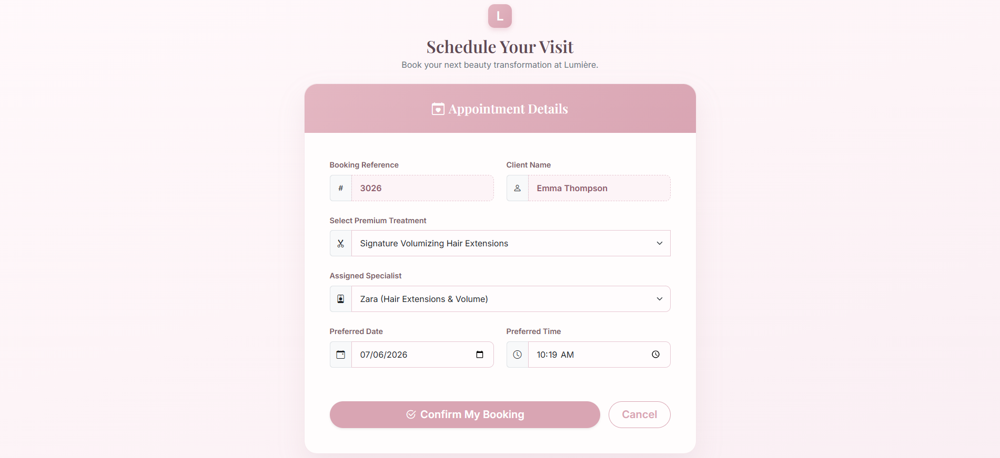
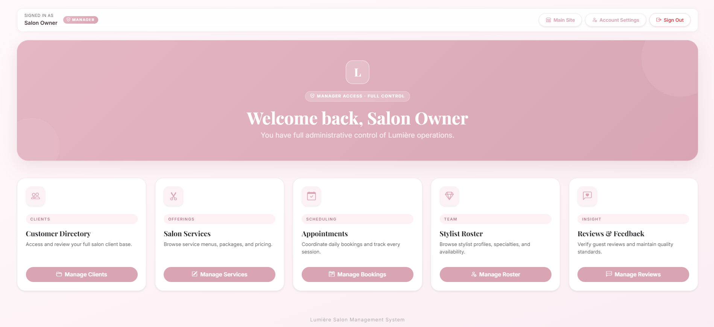
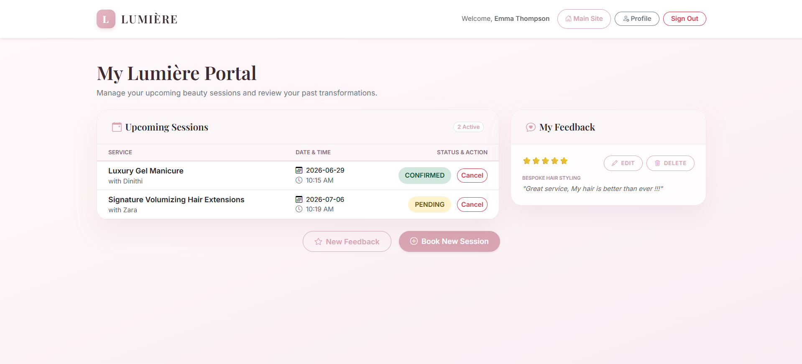
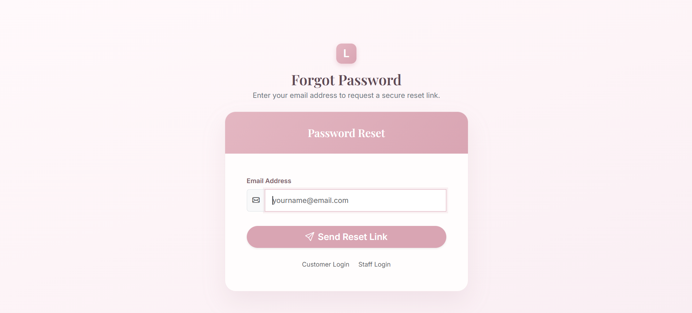

# Lumière Salon Management System

A full-stack salon booking web app built with Spring Boot, MySQL, Thymeleaf, and Spring Security. It supports separate workflows for customers, stylists, and administrators.

Originally developed as a university group project and later expanded by Manula Keshawa Pinidiya [@manulakeshawa](https://github.com/manulakeshawa) as a personal portfolio project.

**Tech highlight:** Java 17 · Spring Boot · MySQL · Thymeleaf · Spring Security

## Tech Stack

| Area | Technologies |
| --- | --- |
| Backend | Java 17, Spring Boot, Spring MVC |
| Security | Spring Security, salted PBKDF2 password hashing |
| Data | MySQL, Spring Data JPA, Hibernate |
| Frontend | Thymeleaf, HTML, CSS, JavaScript |
| Build & Email | Maven / Maven Wrapper, HTTPS transactional email API (Brevo) |

## Main Features

**Customers**

- Register, log in, and manage salon appointments
- Browse services and submit/manage reviews
- Update profile details and change passwords
- Use forgot-password and reset-password flows

**Stylists**

- Log in with email-based staff accounts
- View stylist dashboard and appointment-related workflow
- Update profile details and change passwords

**Administrators**

- Log in using username or email
- Manage customers, stylists, services, appointments, and reviews
- Update admin username, email, and password
- Create customer/stylist accounts and send first-time password setup emails

## Security-Focused Features

- Spring Security role-based access control for `CUSTOMER`, `STYLIST`, and `ADMIN` accounts
- Salted PBKDF2 password hashing with no plain-text password storage
- Global email uniqueness across customer, stylist, and admin account types
- Email-based first-time password setup and forgot-password reset using expiring tokens
- Setup/reset token hashes are stored instead of raw tokens
- Setup/reset links are emailed and not exposed in the admin UI
- CSRF protection, access-denied handling, and environment-based secrets

## Database

The app uses MySQL (`beauty_salon_db`) with Spring Data JPA. On first run, `data.sql` seeds demo data automatically and `SeedDataInitializer` prevents the demo seed from being re-applied on every restart. To reset the demo database, drop and recreate the database, then run the app again.

`data.sql` is demo seed data for a fresh/local database setup, not the live database. Editing or deleting records in MySQL does not automatically update `data.sql`.

> Passwords in `data.sql` are hashed demo passwords. Never store real credentials, email app passwords, reset tokens, or setup tokens there.

## Environment Variables

Configure these values locally before running the app:

| Variable | Purpose |
| --- | --- |
| `PORT` | HTTP port supplied by a deployment platform; defaults to `8080` locally |
| `SPRING_DATASOURCE_URL` | MySQL JDBC URL; defaults to `jdbc:mysql://localhost:3306/beauty_salon_db` |
| `SPRING_DATASOURCE_USERNAME` | MySQL username; defaults to `root` |
| `SPRING_DATASOURCE_PASSWORD` | MySQL password; `DB_PASSWORD` is also supported for local use |
| `DB_PASSWORD` | MySQL password for the local database user |
| `APP_BASE_URL` | Base URL used in emailed setup/reset links, for example `http://localhost:8080` |
| `APP_SEED_ENABLED` | Enables demo seed data from `data.sql`; defaults to `true` |
| `BREVO_API_KEY` | Brevo Transactional Email API key used for HTTPS email sending |
| `MAIL_FROM` | Verified sender email address |
| `MAIL_FROM_NAME` | Sender display name; defaults to `Lumiere Salon` |
| `EMAIL_PROVIDER` | Email provider; optional and defaults to `brevo` |

Email sending uses Brevo's HTTPS transactional email API instead of SMTP, so it works on platforms such as Render Free where outbound SMTP ports are blocked.

Do not commit real secrets or real email API keys.

## Deployment Notes

For cloud deployment, set `SPRING_DATASOURCE_URL`, `SPRING_DATASOURCE_USERNAME`, and either `SPRING_DATASOURCE_PASSWORD` or `DB_PASSWORD` from the platform's secret/environment variable settings. Set `APP_BASE_URL` to the deployed site URL so password setup and reset emails do not point to localhost. Set `BREVO_API_KEY` and a verified `MAIL_FROM` sender for email delivery. If demo data should not run against the deployed database, set `APP_SEED_ENABLED=false`.

## Setup and Run

1. Clone the repository.

   ```powershell
   git clone https://github.com/manulakeshawa/beauty-salon-booking-system.git
   cd beauty-salon-booking-system
   ```

2. Create the MySQL database.

   ```sql
   CREATE DATABASE beauty_salon_db;
   ```

3. Configure the environment variables listed above.

4. Run the application with the Maven Wrapper.

   ```powershell
   .\mvnw.cmd spring-boot:run
   ```

5. Open the app.

   ```text
   http://localhost:8080
   ```

To build without running tests:

```powershell
.\mvnw.cmd clean package -DskipTests
```

## Local Demo Accounts

Demo accounts are for local development only and come from `data.sql`.

| Role | Login | Password |
| --- | --- | --- |
| Admin | `admin` or `admin@lumieresalon.lk` | `lumiere2026` |
| Customer | `amaya.f@email.com` | `amaya123` |
| Customer | `sarah.j@email.com` | `pass123` |
| Stylist | `nalika@lumieresalon.lk` | `#nalika@lume` |
| Stylist | `kasun@lumieresalon.lk` | `#kasun@lume` |
| Stylist | `kamindu@lumieresalon.lk` | `#kamindu@lume` |

These credentials are for local/demo use only

## Screenshots

### Home Page


### Services


### Appointment Booking


### Admin Dashboard


### Customer Dashboard


### Password Reset


## Project Structure

```text
src/main/java/com/manula/beautysalon/
  controller/      MVC controllers
  model/           JPA entities and domain models
  repository/      Spring Data repositories
  security/        Authentication and access control
  service/         Business logic and email/account flows

src/main/resources/
  templates/       Thymeleaf views
  static/          CSS, JavaScript, and image assets
  data.sql         Local demo seed data
  application.properties
```

## Personal Contributions (Post-Group)

- Migrated file-based storage to MySQL/JPA
- Added Spring Security role-based authentication
- Added password hashing, reset emails, and first-time password setup flows
- Improved account management, validation, and documentation

## Original Contributors - Group WD109

| Student ID | GitHub |
| --- | --- |
| IT25102887 | [@IT25102887](https://github.com/IT25102887) |
| IT25101942 | [@IT25101942](https://github.com/IT25101942) |
| IT25101660 | [@IT25101660](https://github.com/IT25101660) |
| IT25100717 | [@Anudi717](https://github.com/Anudi717) |
| IT25101934 | [@it25101934](https://github.com/it25101934) |
